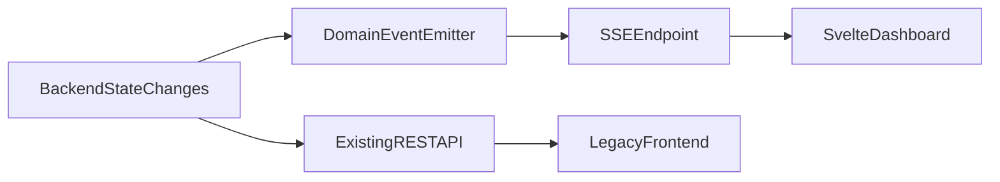

# Incremental Svelte Dashboard Plan

## Goal

Pivot to dashboard-first UX without breaking current operations by running a new Svelte UI in parallel and migrating features incrementally.

## Scope Decisions Locked

- Svelte starts under a separate route (`/svelte`) and does not replace current frontend initially.
- Milestone 1: SSE infrastructure — pipe proven before any real UI is built on top of it.
- Milestone 2: Domain switcher, KPI strip, demand queue wired to the proven SSE pipe.
- SSE is introduced immediately and consumed by Svelte from day one.
- Legacy map remains available and unchanged during early migration.

## Key Files To Touch

- [/Users/tomasztrzcinski/projects/the4s/sentinel/main.py](/Users/tomasztrzcinski/projects/the4s/sentinel/main.py) (mount/serve new Svelte app route)
- [/Users/tomasztrzcinski/projects/the4s/sentinel/frontend/app.js](/Users/tomasztrzcinski/projects/the4s/sentinel/frontend/app.js) (stabilize auto-rerender behavior in legacy UI)
- [/Users/tomasztrzcinski/projects/the4s/sentinel/routers/events.py](/Users/tomasztrzcinski/projects/the4s/sentinel/routers/events.py) (event stream endpoint and event envelope)
- [/Users/tomasztrzcinski/projects/the4s/sentinel/plugins/resources.py](/Users/tomasztrzcinski/projects/the4s/sentinel/plugins/resources.py) (resource status/request hooks for domain events)
- New folder: [/Users/tomasztrzcinski/projects/the4s/sentinel/frontend-svelte](/Users/tomasztrzcinski/projects/the4s/sentinel/frontend-svelte) (Svelte app)

## Architecture Shape

## Milestone 1 - SSE Infrastructure

- Scaffold Svelte app in `frontend-svelte` with route `/svelte` served by FastAPI static mount.
- Define event envelope (id, type, ts, domain, payload, version) and SSE stream endpoint.
- Add simple in-memory event emitter and publish on key lifecycle actions:
  - `ResourceStatusChanged`
  - `ResourceRequested`
  - `ResourceAssigned`
  - `ResourceDeferred`
  - `DomainStatusChanged`
- In Svelte, implement store-driven updates from SSE with reconnect and `Last-Event-ID` support.
- Svelte renders raw event stream output (no real UI yet) — milestone is complete when events flow end-to-end and reconnect is proven.

## Milestone 2 - Dashboard UI

- Build layout for 4-domain switcher, KPI strip, and right-side demand queue, wired to the SSE stores from Milestone 1.
- On initial load, fetch current state via REST before subscribing to SSE — do not rely on SSE alone to populate the dashboard. SSE handles incremental updates only; the REST fetch provides the baseline so the dashboard is never empty on first open.
- Add manual resource registration UI for the Transport domain — name, type, contact, availability status, location. This is the Transport domain fallback (phase 1 of 3 in the spec); KPIs are meaningless without resources in the system.

## Milestone 3 - Fix Legacy UX Risks (No Rewrite)

- Replace full refresh redraw pressure points in legacy app:
  - Keep existing polling for legacy view but restrict updates to changed sections only.
  - Preserve user focus/selection state across updates.
- Adjust map behavior policy in legacy UI:
  - Map may auto-update data layers incrementally.
  - Map must never auto-pan/zoom or steal focus.
  - No pulse/flicker animations on unchanged objects.

## Milestone 4 - Feature Parity Lift into Svelte

- Add map panel to Svelte only after non-map dashboard flows are stable.
- Reuse existing API contracts for compatibility.
- Add action flows for demand queue: `Assign` and `Defer`.
- Keep legacy route as fallback until parity + acceptance checks are complete.

## Acceptance Criteria

### Product-level

- **Morning check-in (peacetime):** Jerzy opens `/svelte`, confirms no active demands across all domains, and closes the tab in under 90 seconds without needing to ask anyone anything.
- **Incoming request flow:** A new resource request appears in the demand queue, Jerzy assigns a resource, and the queue reflects the change — all without a page reload or full rerender.
- **Threshold breach visibility:** A KPI tile that has breached a threshold stays visually distinct until Jerzy explicitly acknowledges it. Switching domains and returning does not reset it.
- **Dual-use legibility:** The dashboard looks calm and uncluttered in peacetime. The same screen with stressed KPIs and a full demand queue communicates crisis without any mode switch.

### Technical

- `/svelte` is accessible and stable without impacting current frontend route.
- Svelte KPI strip and queue update from SSE without full-screen rerender.
- Legacy map no longer flickers on periodic data updates and never shifts viewport automatically.
- Demand queue actions emit events and UI reflects changes within one event cycle.

## Risks and Mitigations

- Event semantics drift: freeze a minimal event schema early and version it.
- Dual-frontend divergence: keep backend contract-first and avoid Svelte-only data shapes.
- SSE reconnect gaps: implement replay cursor via `Last-Event-ID` + short event buffer.
